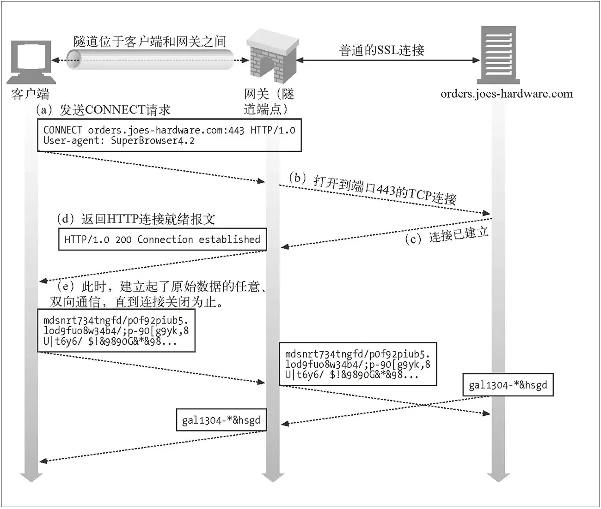
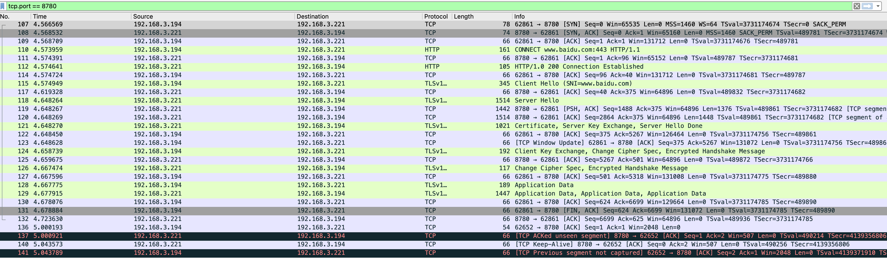

# http 隧道代理
支持HTTP HTTPS Websocket Websockets

# 主要解决目标：客户端不能直接访问的服务，必须通过代理去访问服务

client ---> proxy ————> server

情况A：客户端不能直接访问，127.0.0.1:8080(服务不对外暴露端口)，客户端不能直接访问，需通过代理服务访问

情况B：客户端不能直接访问，10.36.0.130(内网地址)，客户端不能直接访问，需通过代理服务去访问

# 下图是《HTTP 权威指南》书中的插图，它讲解了客户端通过隧道代理连接 HTTPS 服务器的过程。

（a）客户端先发送 CONNECT 请求到隧道代理服务器，告诉它建立和服务器的 TCP 连接（因为是 TCP 连接，只需要 ip 和端口就行，不需要关注上层的协议类型）

（b，c）代理服务器成功和后端服务器建立 TCP 连接

（d）代理服务器返回 HTTP 200 Connection Established 报文，告诉客户端连接已经成功建立

（e）这个时候就建立起了连接，所有发给代理的 TCP 报文都会直接转发，从而实现服务器和客户端的通信

假如通过代理访问 A 网站，浏览器首先通过 CONNECT 请求，让代理创建一条到 A 网站的 TCP 连接；一旦 TCP 连接建好，代理转发后续流量即可。所以这种代理，理论上适用于任意基于 TCP 的应用层协议，HTTPS 网站使用的 TLS 协议当然也可以。这也是这种代理为什么被称为隧道的原因。对于 HTTPS 来说，客户端透过代理直接跟服务端进行 TLS 握手协商密钥，所以依然是安全的。

# 抓包看一下

可以看到，浏览器与代理进行 TCP 握手之后，发起了 CONNECT 请求，报文起始行如下：
110	4.573959	192.168.3.194	192.168.3.221	HTTP	161	CONNECT www.baidu.com:443 HTTP/1.1 

对于 CONNECT 请求来说，只是用来让代理创建 TCP 连接，所以只需要提供服务器域名及端口即可，并不需要具体的资源路径。代理收到这样的请求后，需要与服务端建立 TCP 连接，并响应给浏览器这样一个 HTTP 报文：

112	4.574641	192.168.3.221	192.168.3.194	HTTP	105	HTTP/1.0 200 Connection Established 

